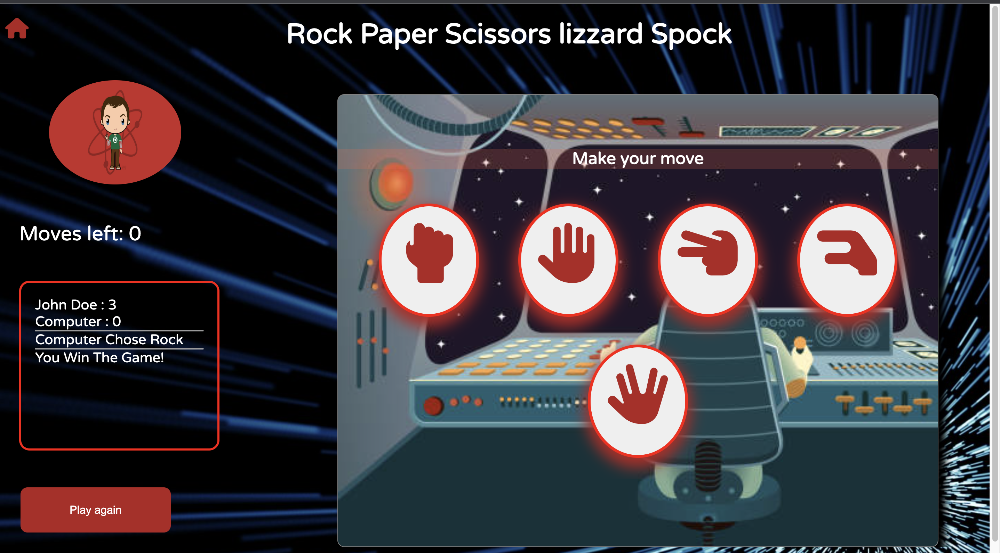

# Rock Paper Scissors Lizard and Spock.
## Project DESCRIPTION:
Fake scenario: A social club (The Sheldon Cooper's of the world) want a simple website that invites people to join them. Aside from a website that represents them and their interest on astrophysics, they want to have a fun simple game.

The idea from this game is inspired from the Big Bang theory tv show and for that it is targeted towards individuals interested in the show.
Especially, those who are a fan of Sheldon Cooper, the originator of this game. 
The game is a modification of the original rock, paper, scissors. it includes lizard and spock, a character from the start trek franchise. 
therefore, the game aims to draw people interested in big bang theory, Sheldon Cooper and other characters, and Star Trek.
### Deployment.

The deployed website can be found at (https://jonfd4.github.io/projectportfolio2.1/)

### Rules of games.

The game is a zero-sum game meant for settling disputees. it is simple to play and so the rules are easy f=to follow.
1. Rock crushes Lizard
2. Lizard poisons Spock
3. Spock smashes Scissors
4. Scissors decapitate Lizard
5. Lizard eats Paper
6. Paper disproves Spock
7. Spock vaporizes Rock
8. Rock crushes Scissors

## Overview
The project involved building a rock, paper, scissors, lizard, spock game using HTML, CSS and JavaScript. The player is presented with 5 options they can choose from. The choice will be compared to the computer's automated selection of the same choices as the user. the result will be dispalyed on the scoreboard and compared to decide who wins. 

## Product

* The responsiveness of index page tested on amiresponsive website *
  
  * The responsivenes of game page tested on amiresponsive website *
## Development Process

To develop the game, the following steps were followed:

### Defining  Project Goal (UX)
 *What would user want?*
- to be able feel goood and be excited about website.
- to be able to immediately start playing the game
- to have clear and concise information about progress of game and final results.
- to be able to track scores

*What are the developers goals*
-  a project that test their understanding of javascript and development of game logic.
- a site that vistors can be excited about and one that is easily navigable
- a game and a site that is fun, niche and interest-focused.
- a very simple interface that is responsive.

#### Mind map and lo-fi development

*Developed using lucidsparks*

*Developed using rp.mockplus. There images for all lo-fi are not on here because they are a lot, hence the rest are stored in the readmeimages folder in the lo-fi folder.
The files where developed with consideration to responsiveness. Notably, this is a mock up  and so not all design ideas where implemented in the actual product. *
### Tools used in creating website

 **Planning:** 
The requirements and features of the game were defined, including understanding the rules of Rock Paper Scissors Spock Lizard and how the game mechanics should work.
Mind maps and lo-fi mock ups where used in design what the webisye could potentially look like. The 
The game is implemented using HTML, CSS, and JavaScript.

**HTML Structure:** The HTML structure was created, including the necessary elements like buttons, scoreboards, and game result display.

**CSS Styling:** CSS was utilized to add styles and make the game visually appealing. The layout, colors, fonts, and animations were implemented to enhance the user experience.
 **JavaScript Logic:** The game logic was implemented using JavaScript. This included functions to handle user clicks, generate random computer moves, determine the winner of each round, and update the score. Javascript was also used in implement personalisation featurs such as prompting the user's name.

 **Testing and Debugging:** The game was thoroughly tested for different scenarios and any bugs or errors were identified and fixed. This involved using browser developer tools for debugging purposes.

 **Validation:** The code was reviewed to ensure it follows best practices and is free of syntax errors or potential security vulnerabilities. Accessibility considerations were also taken into account to make the game usable by all users.

## Features 
### Index page features

-It contains the header which shows the logo, a blue rocket with Sheldon's army underneath, and the other side is the home, about and follow us(leads to the footer).
-The header was designed to be responsive so that at screen widths below 800 it becomes a menu button which when clicked on produces a drop down of items.

 
The CTA buttons direct user to the the game area and the rules section.
They are responsive and when sreen-width is smaller will transition into a column whereby click rules button will be underneath the click to play.

### Game page features

The Rock Paper Scissors Spock Lizard game includes the following features:

1. **Buttons:** Buttons for the player to select their move (Rock, Paper, Scissors, Spock, or Lizard).

2. **Score Display:** The current scores of the player and computer are displayed. Additionally the computer choices 

3. **Game Result:** After each round, the result is displayed, including who won or if it was a tie and final result are displayed.
   
4. The number of moves left is also dispalyed

5. **Reset Option:** A reset button is available to restart the game and reset the scores.
   - The reset buttin(play again) on widescreen sits beside the game board, underneath the score board. However, it appears above the gameboard when screen size is reduced. This iis done by create two buttons, similar function and using display:none property on under the unique attributes in media queries.

6. There is a home button icon to send user back to the home page.
    
## Evaluating responsiveness and browser compatibility
 **Browser Compatibility:** The game was tested in multiple browsers (e.g., Chrome, Safari) to ensure cross-browser compatibility.
 Further testing was done on responsiveness using iphone XR to test display of all components of website.
 
  
   
      
These images clarify the responsiveness and browser compatibility that the website has with safari.

## Validation and Debugging

During development, the code was validated and tested using the following methods:

1. **Syntax Validation:** HTML, CSS, and JavaScript code were validated using validators to identify any syntax errors or invalid code.

JavaScript validation was done using devtools and console.log to determine output of code.
  
* Image of home page validation *
   
* Image of home game validation: There was a lot of trailing slash errors which were not dealt due to their lack of impact on the web page. *

  
* Image of CSS validation: The errors shown were just bad practice code writing and were fixed immediately*
  
2. **Debugging:** When issues or bugs were discovered, the browser's developer tools were utilized to find error messages, inspect variables, and trace the code to identify and fix the bugs.

3. **User Testing:** The game was shared with potential users, and their feedback was collected to identify any issues or suggestions for improvement.
   
5. **Accessibility** There was great consideration for accessibility. Lighthouse analysis was carried out through out development processs to test accessibility in terms of contrast, readability, screen-reader friendliness.
   
   *Home page lighthouse analysis*
      
   *Game page lighthouse analysis*
By following these steps, the Rock Paper Scissors Spock Lizard game was successfully developed, ensuring its functionality, responsiveness, and user-friendliness. Enjoy playing the game, and may luck be on your side in this geeky variation of the classic game!
